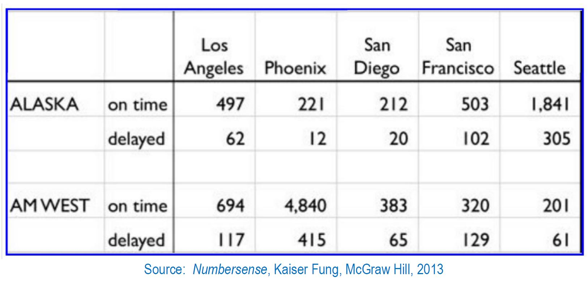

<style>
  .main-container {
    max-width: 1200px !important;
  }
</style>
---

\newpage
# Week 5 - Flight Delays

## The assignment is as follows:

#### A chart is supplied, listing flight performance (on-time vs. delayed) for two airlines (ALASKA and AM WEST) across five cities (Los Angeles, Phoenix, San Diego, San Francisco, and Seattle):    

```{r gridpic, eval=T}
# pull Airline Delays JPG file from github - only usable for HTML knit -- will not work for PDF knit
airline_delays_pic_URL <- "https://raw.githubusercontent.com/myampol/MY607/master/Airline_Delays.JPG"
### Determine whether we are knitting to PDF ("latex") or HTML
whichknit <- knitr::opts_knit$get("rmarkdown.pandoc.to") # Works only if knit() is called via render()
if (!is.null(whichknit)) {   # can't test the below items if whichknit returned NULL
  if (whichknit=="latex") {
       ### PDF knit requires that the file be local
  } else if (whichknit=="html") {
    knitr::include_graphics(airline_delays_pic_URL) ### HTML knit will accept URL to insert picture
  }
}
```


#### (1) Create a .CSV file (or optionally, a MySQL database!) that includes all of the information above. You’re encouraged to use a “wide” structure similar to how the information appears above, so that you can practice tidying and transformations as described below.
#### (2) Read the information from your .CSV file into R, and use `tidyr` and `dplyr` as needed to tidy and transform your data.
#### (3) Perform analysis to compare the arrival delays for the two airlines.
#### (4) Your code should be in an R Markdown file, posted to rpubs.com, and should include narrative descriptions of your data cleanup work, analysis, and conclusions.

```{r setup, include=FALSE}
knitr::opts_chunk$set(echo = TRUE)
directory = "C:/Users/Michael/Dropbox/priv/CUNY/MSDS/201909-Fall/DATA607_Tati_Andy/20190929_Week05/"
knitr::opts_knit$set(root.dir = directory)
options(encoding = 'UTF-8')
### Make the output wide enough
options(scipen = 999, digits=6, width=125)
```

## Load libraries
```{r loadlibs, eval=T}
#library(readr)
#library(stringr)
library(tidyr)
library(dplyr)
library(ggplot2)
library(kableExtra)
```

\newpage
## Data Loading

### Load the raw datafile (which I created by entering the given values into an excel spreadsheet, then saving the spreadsheet as a .csv file) :

```{r load-raw-datafile, eval=T}
#setwd("C:/Users/Michael/Dropbox/priv/CUNY/MSDS/201909-Fall/DATA607_Tati_Andy/20190929_Week05")
### Don't pull file from local drive
#inputfile <- "InputFlightData.csv"
### Pull the input data file from github, rather than local drive
inputfile <- "https://raw.githubusercontent.com/myampol/MY607/master/InputFlightData.csv"
rawflights <- read.csv(inputfile,stringsAsFactors = F)
rawflights %>% kable() %>%  kable_styling(c("striped", "bordered"))
```

#### Modify the column headings to clean up the naming:
```{r rename, eval=T}
rf1 <- rename(.data = rawflights, Airline=X, Status=`X.1`, 
              LosAngeles=`Los.Angeles`, SanDiego=`San.Diego`, SanFrancisco=`San.Francisco`)
rf1 %>% kable() %>%  kable_styling(c("striped", "bordered"))
```

\newpage
## Data Cleanup Work

### Reviewing Hadley Wickham's directive for creating "tidy" data, it is necessary to distinguish between *Fixed Variables* and *Measured Variables* .

### **Fixed Variables** :    
 (a) the airline (AM West or Alaska), and    
 (b) the city (Los Angeles, Phoenix, San Diego, San Francisco, and Seattle)

### **Measured Variables** : 
 (c) the count of **ON TIME** flights and    
 (d) the count of **DELAYED** flights    

 for each (Airline,City) pair.

\newpage
### **tidyr / dplyr** steps:

### **GATHER** :
#### First, use **gather** to put all the Cities into one column, and also drop the row containing NAs: 

```{r gather, eval=T}
rf2 <- gather(data = rf1 , key = City, value = NumFlights, ... = LosAngeles:Seattle, na.rm = T)
rf2 %>% kable() %>%  kable_styling(c("striped", "bordered"))
```

\newpage
### **MUTATE(lag)** :
#### Next, use **mutate(lag)** to propagate the Airline names downward (from each odd-numbered row) to fill the missing airline name (on the subsequent even-numbered row):

```{r lag, eval=T}
rf3 <- mutate(.data = rf2, Airline= ifelse(Airline=="", lag(Airline), Airline))
rf3 %>% kable() %>%  kable_styling(c("striped", "bordered"))
```


\newpage
### **SPREAD** :
#### Now, use **spread** to put the "on time" and "delayed" counts into separate columns:  
```{r spread, eval=T}
rf4 <- spread(data = rf3, key = Status, value = NumFlights)
rf4 %>% kable() %>%  kable_styling(c("striped", "bordered"))
```


### **RENAME** :
#### Use **rename** to improve the names of the "on time" and "delayed" columns:  
```{r clean-up-citynames, eval=T}

rf5 <- rename(.data = rf4, NumFlightsDelayed=delayed, NumFlightsOnTime=`on time`)
rf5 %>% kable() %>%  kable_styling(c("striped", "bordered"))
```

\newpage
### **MUTATE** :
#### Use **mutate** to compute and append **NumFlightsTotal**:  
```{r get-total-flights, eval=T}
rf6 <- mutate(.data = rf5, NumFlightsTotal = NumFlightsDelayed + NumFlightsOnTime)
rf6 %>% kable() %>%  kable_styling(c("striped", "bordered"))
```

#### Use **mutate** to compute and append the *percentage* of delayed and ontime flights at each city:  
```{r compute-percentages, eval=TRUE}
rf7 <- mutate(.data = rf6, PctFlightsDelayed=NumFlightsDelayed/NumFlightsTotal,
                           PctFlightsOnTime=NumFlightsOnTime/NumFlightsTotal)
rf7 %>% kable() %>%  kable_styling(c("striped", "bordered"))
```

\newpage
#### The above shows the data tidying and manipulation step-by-step.
### Chain using pipe connector **"%>%"** :
Using the pipe connector "%>%", all the above steps can be specified in a single chain:   
```{r chain-tidy-commands, eval=T}
tidy_flights <- rawflights %>%
  rename(.data = ., Airline=X, Status=`X.1`, LosAngeles=`Los.Angeles`, 
                                             SanDiego=`San.Diego`, 
                                             SanFrancisco=`San.Francisco`)                 %>%
  gather( data = ., key = City, value = NumFlights, ... = LosAngeles:Seattle, na.rm = T)   %>%
  mutate(.data = ., Airline= ifelse(Airline=="", lag(Airline), Airline))                   %>%
  spread( data = ., key = Status, value = NumFlights)                                      %>%
  rename(.data = ., NumFlightsDelayed=delayed, NumFlightsOnTime=`on time`)                 %>%
  mutate(.data = ., NumFlightsTotal = NumFlightsDelayed + NumFlightsOnTime)                %>%
  mutate(.data = ., PctFlightsDelayed=NumFlightsDelayed/NumFlightsTotal,
                    PctFlightsOnTime=NumFlightsOnTime/NumFlightsTotal)
tidy_flights %>% kable() %>%  kable_styling(c("striped", "bordered"))
```

#### The above result matches that from the step-by-step process.

\newpage
## Analyze the data

### Let's sort the above data by city, then by airline:
```{r sort-by-city, eval=T}
arrange(tidy_flights, City, Airline) %>% kable() %>%  kable_styling(c("striped", "bordered"))
ALASKA_Phoenix_delays <- filter(.data=tidy_flights, Airline=="ALASKA" & City=="Phoenix") %>% 
  select(PctFlightsDelayed)
AMWEST_Phoenix_delays <- filter(.data=tidy_flights, Airline=="AM WEST" & City=="Phoenix") %>% 
  select(PctFlightsDelayed)
ALASKA_SanFrancisco_delays <- filter(.data=tidy_flights, Airline=="ALASKA" & City=="SanFrancisco") %>%
  select(PctFlightsDelayed)
AMWEST_SanFrancisco_delays <- filter(.data=tidy_flights, Airline=="AM WEST" & City=="SanFrancisco") %>%
  select(PctFlightsDelayed)
```

\newpage
#### What's noticeable is that looking ***city-by-city***, the **Percentage of Flights Delayed** is smaller for ALASKA than it is for AMWEST: 

#### Percentage of flights delayed for each airline, by city: 
```{r percent-delays-by-city, eval=T}
Pct_Delays_by_City <- tidy_flights %>% 
  select(.data = ., -NumFlightsDelayed, -NumFlightsOnTime, 
                    -NumFlightsTotal, -PctFlightsOnTime) %>%
  spread(data = . , key = Airline, value = PctFlightsDelayed)
Pct_Delays_by_City %>% kable() %>%  kable_styling(c("striped", "bordered"))
```

#### For example, at Phoenix, ALASKA's delays are `r round(100*ALASKA_Phoenix_delays,1)`% while AM WEST's delays are `r round(100*AMWEST_Phoenix_delays,1)`% . 
#### At SanFrancisco, ALASKA's delays are `r round(100*ALASKA_SanFrancisco_delays,1)`% while AM WEST's delays are `r round(100*AMWEST_SanFrancisco_delays,1)`% . 
#### The above relationship holds *for each city*. 

\newpage
### Plot percent delays **by city**:

```{r plot-delays-by-city-and-airline, eval=TRUE}
Pct_Delays_by_City %>% gather(data = ., key = Airline, 
                              value = Pct_Delays_by_City,...=ALASKA:`AM WEST`) %>%
    ggplot(data = ., aes(factor(City), Pct_Delays_by_City, fill = Airline)) + 
    geom_bar(stat="identity", position = "dodge") + 
    theme_minimal()+
    labs( x="City", y="Percentage of flights which are Delayed") +
    ggtitle("Percentage of flights which are Delayed, by City and Airline")
```

### Flights and delays **by airline**
#### Question: How many **TOTAL** flights does each airline have, and what **PERCENT** are delayed?
```{r results-by-airline, eval=T}

ResultsByAirline <- group_by(tidy_flights,Airline) %>% summarize(
                                             TotalDelays=sum(NumFlightsDelayed),
                                             TotalOnTime=sum(NumFlightsOnTime),
                                             TotalFlights=sum(NumFlightsTotal), 
                                             PctDelayed=TotalDelays/TotalFlights, 
                                             PctOnTime=TotalOnTime/TotalFlights)
ResultsByAirline %>% kable() %>%  kable_styling(c("striped", "bordered"))
ALASKAdelays <- filter(.data = ResultsByAirline, Airline=="ALASKA") %>% select(PctDelayed)
AMWESTdelays <- filter(.data = ResultsByAirline, Airline=="AM WEST") %>% select(PctDelayed)
ALASKAtotals <- filter(.data = ResultsByAirline, Airline=="ALASKA") %>% select(TotalFlights)
AMWESTtotals <- filter(.data = ResultsByAirline, Airline=="AM WEST") %>% select(TotalFlights)
```

    
#### These results show that while **ALASKA** runs about *half as many flights* (`r ALASKAtotals`) as its competitor **AM WEST** (`r AMWESTtotals`), a **larger** percentage (`r round(100*ALASKAdelays,1) ` %) of **ALASKA's** flights are delayed vs. AM WEST, which suffered delays on only `r round(100*AMWESTdelays,1)` % of its flights.
\newpage
#### Plot:

```{r plot-delays-by-airline, eval=TRUE}
ResultsByAirline %>% select(.data = ., Airline, PctDelayed) %>%
    ggplot(data = ., aes(factor(Airline), PctDelayed, fill = Airline)) + 
    geom_bar(stat="identity", position = "dodge") + 
    theme_minimal()+
    labs( x="Airline", y="Percentage of flights which are Delayed") +
    ggtitle("Percentage of flights which are Delayed, by Airline")
  
```

\newpage
### Simpson's Paradox:

#### So, this is curious!  
#### On a **city-by-city** basis, ALASKA "beat" AM WEST by having better on-time performance at every city.   
#### But on an **overall** basis, **AM WEST** had the best overall on-time results!   
  
#### This is a manifestation of a curiosity known as "Simpson's Paradox".  

    https://en.wikipedia.org/wiki/Simpson%27s_paradox   

#### How could this paradox be explained?

#### Although the data shows that each airline serves the same 5 cities, they seem to focus on different markets.  

#### Perhaps looking more closely at the different cities served by each airline can help explain?

\newpage
### City by city:
#### First, let's determine how many TOTAL flights go to each city, and what percent are delayed?

```{r results-by-city, eval=T}

ResultsByCity <- group_by(tidy_flights,City) %>% summarize(
                                             TotalDelays=sum(NumFlightsDelayed),
                                             TotalOnTime=sum(NumFlightsOnTime),
                                             TotalFlights=sum(NumFlightsTotal), 
                                             PctDelayed=TotalDelays/TotalFlights, 
                                             PctOnTime=TotalOnTime/TotalFlights)
ResultsByCity %>% kable() %>%  kable_styling(c("striped", "bordered"))
PhoenixDelays      <- filter(.data = ResultsByCity, City=="Phoenix") %>% select(PctDelayed)
SanFranciscoDelays <- filter(.data = ResultsByCity, City=="SanFrancisco") %>% select(PctDelayed)

```

#### This shows that the ***smallest*** percentage  (`r round(100*PhoenixDelays,1)`%) of flights are delayed at ***Phoenix***, while the ***largest*** percentage  (`r round(100*SanFranciscoDelays,1)`%) of flights are delayed at ***SanFrancisco***:     

\newpage
#### ResultsByCity, sorted by PctDelayed:
```{r sort-Pct-Delayed, eval=T}
arrange(ResultsByCity, PctDelayed) %>% kable() %>%  kable_styling(c("striped", "bordered"))
```
\newpage
### Here's a barplot:
```{r plot-delays-by-city, eval=T}
select(.data = ResultsByCity, City, TotalDelays) %>%
    ggplot(data = ., aes(factor(City), TotalDelays, fill = City)) + 
    geom_bar(stat="identity", position = "dodge") + 
    theme_minimal()+
    labs( x="", y="Total Number of Delays") +
    ggtitle("Total Number of Delays, by city") 

```

\newpage
#### Although the largest **absolute** number of ***delays*** occurs in Phoenix, it is the city with the **largest** number of ***overall*** flights.  
```{r plot-flights-by-city, eval=TRUE}
select(.data = ResultsByCity, City, TotalFlights) %>%
    ggplot(data = ., aes(factor(City), TotalFlights, fill = City)) + 
    geom_bar(stat="identity", position = "dodge") + 
    theme_minimal()+
    labs( x="", y="Total Number of Flights") +
    ggtitle("Total Number of Flights, by city") 

```

\newpage
#### Indeed, the **percentage** of delays at Phoenix is the **lowest** across all 5 cities.
```{r plot-pct-delays-by-city, eval=TRUE}
select(.data = ResultsByCity, City, PctDelayed) %>%
    ggplot(data = ., aes(factor(City), PctDelayed, fill = City)) + 
    geom_bar(stat="identity", position = "dodge") + 
    theme_minimal()+
    labs( x="", y="Percentage of Delayed Flights") +
    ggtitle("Percentage of Delayed Flights, by city") 

```

\newpage
### Relative market share

#### Let's determine the **relative market share** of each airline at each city, to see if that helps explain the delays:

#### Use **merge** to join the ***Totals(by city)*** onto the ***tidy_flights*** dataframe.  

```{r merge-totals, eval=T}

big_flights <- tidy_flights %>% 
  merge(ResultsByCity) %>%   
  arrange(.data = ., City, Airline) %>%
  mutate(.data = ., ShareOfDelays=NumFlightsDelayed/TotalDelays, 
                    ShareOfOnTime=NumFlightsOnTime/TotalOnTime,
                    ShareOfFlights=NumFlightsTotal/TotalFlights)
big_flights %>% kable() %>%  kable_styling(c("striped", "bordered"))
```

\newpage
### Plot airline market share, by City:
```{r plot-airline-market-share-by-city, eval=T}
select(.data = big_flights, City=City,Airline=Airline,ShareOfFlights=ShareOfFlights) %>%
    ggplot(data = ., aes(factor(City), ShareOfFlights, fill = Airline)) + 
    geom_bar(stat="identity", position = "dodge") + 
    theme_minimal()+
    labs( x="City", y="Airline's relative market share") +
    ggtitle("Airline's relative market share, in each city")
```


#### The above helps clarify the picture.    

### Good Weather vs. Bad Weather

#### ***Phoenix*** is known to be a city with "good weather" - it is a desert location where it seldom rains.    
#### **AM WEST** (which no longer exists as an independent entity due to its 2005 merger with US Air, which then merged in 2015 with American Airlines) was based in Phoenix, which is where it dominated the market.  It also had larger market share (than ALASKA) in both ***San Diego*** and ***Los Angeles***, both comparatively "good weather" cities.    

#### On the other hand, **ALASKA** Airlines is based in Seattle, *which is cloudy/rainy for more than 300 days per year* (the exception being July and August.)  Alaska Airlines flies mainly up and down the west coast, including flights to Alaska (hence its name) plus San Francisco, where it had larger market share than AM West.  *San Francisco is known for being foggy much of the time*, which results in a large percentage of flight delays there.


## Conclusion

### Simpson's Paradox explained:

#### The explanation for the paradox, "*How could one airline* (**ALASKA**) *have better on-time performance* ***at each city***, *while the other airline* (**AM WEST**) *has better on-time performance* ***overall?***" is found in the nature of cities in which each airline chooses to predominate, and the respective propensity for delays in such cities.    

#### An airline which flies mainly to "bad weather" locations like ***Seattle*** and ***San Francisco***, where a larger percentage of flights experience delays, is likely to have worse ***overall*** on-time performance when compared against an airline which flies mostly to "good weather" cities like ***Phoenix***, ***Los Angeles***, and ***San Diego***.  

#### Even if an airline boasts better on-time performance **at each city**, its **overall** performance can suffer because of its route map.

#### In this regard, **ALASKA** has won each of the "*battles*" (based on *within-city* comparison), but **AM WEST** has won the "*war*."
