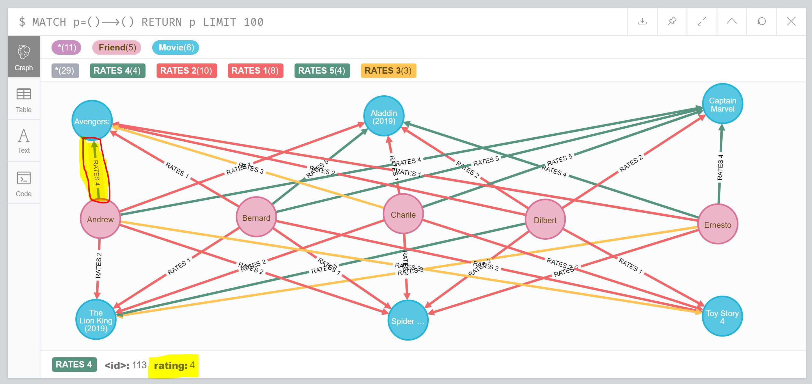
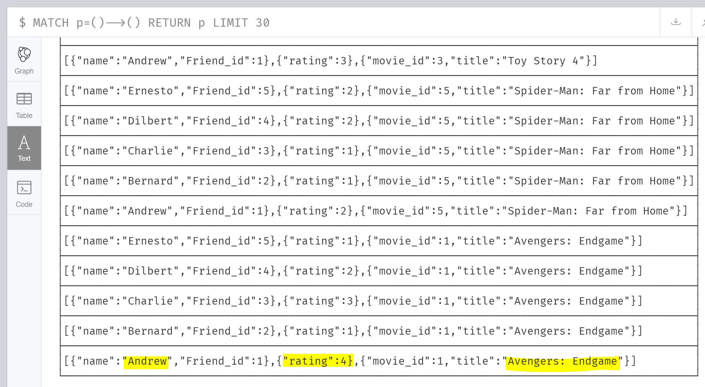

# Assignment 12 - Migrate data from MySQL to Neo4j

For this assignment, you should take information from a relational database and migrate it to a NoSQL database of your own choosing.

For the relational database, you might use the flights database, the tb database, the "data skills" database your team created for Project 3, or another database of your own choosing or creation.

For the NoSQL database, you may use MongoDB (which we introduced in week 7), Neo4j, or another NoSQL database of your choosing.

Your migration process needs to be reproducible.  R code is encouraged, but not required.  You should also briefly describe the advantages and disadvantages of storing the data in a relational database vs. your NoSQL database.

```{r setup, include=FALSE}
knitr::opts_chunk$set(echo = TRUE)
```

```{r libraries}

library(kableExtra)

# library to connect to MySQL database
library(RMySQL)

# RNeo4j has been removed from CRAN and is hosted by the package creator: 
# devtools::install_github("nicolewhite/RNeo4j")
library(RNeo4j)

# library to display results
library(igraph)

```

#### This project extends the "Movies" database that was created in Week 2.    

Rpubs output from Week 2:  <http://rpubs.com/myampol/MY607-Week02-MichaelY-Movies>    

R code from Week 2: <https://raw.githubusercontent.com/myampol/MY607/master/MY-DATA607-Week02-Movies.Rmd>    

SQL code from Week 2: <https://raw.githubusercontent.com/myampol/MY607/master/MY-DATA607-Week02-Movies.sql>    

It assumes that the above database has already been created in a MySQL database which is on the same machine as the Neo4j database into which the data will be loaded, below.  

\newpage
## Pull data from MySQL

We will not dump the data into files (e.g., .csv files) and then upload such files into Neo4j.   

Rather, we will pull the data into R, and then push the data from R directly into Neo4j.   

### Connect to the movies MySQL database (from Week 2)
```{r connect-MySQL-movies}
# I created "stduser" as a read-only account in my database which only has "select" privilege
moviesconnstd <- dbConnect(MySQL(), 
                           user="stduser", 
                           password="password", 
                           dbname="Week2_Movies", 
                           host="localhost")
```

\newpage
### Query each MySQL table separately
```{r movies-friends-ratings}

### Get the table of friends
friends_query <- 'Select Friend_id, Friend_name from friends'
friends_result <- dbGetQuery(moviesconnstd, friends_query)
friends_result %>% kable() %>% kable_styling(c("striped", "bordered"))

### Get the table of movies
movies_query <- 'select Movie_id, Movie_title from movies'
movies_result <- dbGetQuery(moviesconnstd, movies_query)
movies_result %>% kable() %>% kable_styling(c("striped", "bordered"))

### Get the table of ratings, which uses ID numbers rather than names
ratings_query <- 'select Movie_id, Friend_id, Rating from ratings'
ratings_result <- dbGetQuery(moviesconnstd, ratings_query)
ratings_result %>% kable() %>% kable_styling(c("striped", "bordered"))
```

***
\newpage
#### Get movies, friends, and ratings data from MySQL in a single query
```{r movies-data}

# Create a query which joins the 3 database tables, 
# replacing the auto-generated ID codes with the movie names and the reviewers' names

bigquery <- 'Select M.Movie_title, F.Friend_name, R.Rating
                From Movies as M, Friends as F, Ratings as R
                Where (M.Movie_id = R.Movie_ID AND F.Friend_id = R.Friend_ID);'

# Execute the query
bigresult <- dbGetQuery(moviesconnstd, bigquery)

# display the results
bigresult %>% kable() %>% kable_styling(c("striped", "bordered"))
```

Note that there are only 29 ratings, as one person (Ernesto) did not rate one film (Toy Story 4).

***
\newpage
## Connect to Neo4j 
```{r connect neo4j}
MyGraph = startGraph("http://localhost:7474/db/data/",username="neo4j",password="password")
```

We will establish a connection to Neo4j.  This requires that the database be up and running.  An (empty) database needs to have already been created as the default database.  (It should be empty, because the next step will delete all nodes, relationships, indexes, and constraints from the graph database...)

### Clear the Neo4j graph
```{r clear neo4j}
# This statement will delete all nodes, relationships, indexes, 
# and constraints from the connnected Neo4j database
clear(MyGraph, input = F)
```

### Load the friends data, as nodes
```{r load-friends-data}

# make an empty list to store the created nodes (locally in R) for use later
friend_nodes = list()

# loop through each friend
for (i in 1:nrow(friends_result)){
  # Create a node with the "name" property identifying the friend; 
  # store this node (locally in R) in a list for use later
  friend_nodes[[friends_result$Friend_id[i]]] = createNode(MyGraph, 
                                                         "Friend",
                                                         name=friends_result$Friend_name[i],
                                                         Friend_id=friends_result$Friend_id[i])  
}
```

### Load the movies data, as nodes
```{r load-movies-data}

# make an empty list to store the created nodes (locally in R) for use later
movie_nodes = list()

# loop through each movie
for (i in 1:nrow(movies_result)){
  # Create a node with the "title" property identifying the friend; 
  # store this node (locally in R) in a list for use later
  movie_nodes[[movies_result$Movie_id[i]]]  = createNode(MyGraph, 
                                                         "Movie",
                                                         title=movies_result$Movie_title[i],
                                                         movie_id=movies_result$Movie_id[i])  
}
```

### Load the ratings into Neo4j

#### The ratings are "relationships" connecting the Friend and Movie nodes

By creating 5 separate relationships, based upon rating, we can assign different colors to the ratings in the graph below.

```{r load-ratings-data}

# make an empty list to store the created nodes (locally in R) for use later
ratings_relations = list()

# Loop through each rating relation, storing the result 
for (i in 1:nrow(ratings_result)){
  # We need to retrieve the NODE from the above list of movie nodes 
  # for creation of the ratings relation in Neo4j
  thismovie = movie_nodes[[ratings_result$Movie_id[i]]]
  
  # We need to retrieve the NODE from the above list of friend nodes 
  # for creation of the ratings relation in Neo4j
  thisfriend = friend_nodes[[ratings_result$Friend_id[i]]]
  
  # This is just the numerical rating {1,2,3,4,5} -- but it could be NA
  thisrating = ratings_result$Rating[i]

  ## There is an "NA" in the ratings grid, 
  ## because one person (Ernesto) did not rate one movie (Toy Story).
  ## Since there is no relationship in this case, 
  ## we will not create a relationship in the graph database  
  if(is.na(ratings_result$Rating[i])) {
    print(paste(i,": *** ", thisfriend$name, " DID NOT RATE ", thismovie$title))
  } else 
    {
      print(paste(i,": ", thisfriend$name, " rated ", thismovie$title, " a ", thisrating))
      
      # Creating the relation in Neo4j, and save the relationship (in R) in a list
      ratings_relations[i] <- createRel(thisfriend, paste("RATES",thisrating), thismovie, rating=thisrating)
    }
}

```

### Display the set of relationships
```{r summary}
summary(MyGraph)
```


This shows that we have implemented 5 separate relationships, "Friend --> RATES {1|2|3|4|5} -->  Movie"

This enables us to assign a different color to the different ratings arrows.

Below I have assigned red to the poor ratings (1 and 2), yellow to the neutral rating (3), and green to the best ratings (4 and 5).   This indicates that everybody hated **Spiderman: Far from Home**, while everybody (except Dilbert) liked **Captain Marvel**.  (However, Dilbert hated everything except for the **Lion King**, so perhaps his opinion can be discounted...)


### Neo4j graph
```{r display-image-1, echo=FALSE, out.width = '100%'}

```

In the lower right, note the absence of any arrow between **Ernesto** and **Toy Story 4**, as Ernesto did not rate that film.

The relationship highlighted in yellow indicates that **Andrew** gave a rating of "4" to **Avengers:Endgame**, which is also reflected in this tabular view"

### Neo4j tabular listing
```{r display-image-2, echo=FALSE, out.width = '100%'}

```


### Pull the data back from Neo4j
```{r pullback}
query = "
MATCH (f:Friend)-[r]->(m:Movie)
RETURN f.name, m.title, r.rating 
"
# Query Neo4j using "cypher"
edgelist = cypher(MyGraph, query)

# display the results to confirm that the data is present
edgelist %>% kable() %>% kable_styling(c("striped", "bordered"))
```

***
\newpage
### Plot the graph using igraph
```{r plot-neo4j, fig.width=10, fig.height=10}
ig = graph.data.frame(edgelist, directed=T)
plot(ig)
```

The resulting graph is not easy to read.  (More options are needed to make this graph look better.)    


***
\newpage
## Advantages of SQL vs. Neo4j

#### You should also briefly describe the advantages and disadvantages of storing the data in a relational database vs. your NoSQL database.

The advantage of storing the data in the NoSQL database is that we can traverse relationships to determine who liked which movie.  In the relational database, it is less easy to visualize the relationships.

Here, however, there is a disadvantage in that it can become difficult to visualize a large number of relationships, especially if the number of movies and the number of reviewers were larger.

In the present dataset, with only a single exception,  every friend rated every movie. In the case of a much larger dataset, it is more likely that the data would be sparse, i.e., there would be many (friend,movie) combinations which would be unrated because there would be too many movies for every person to see.